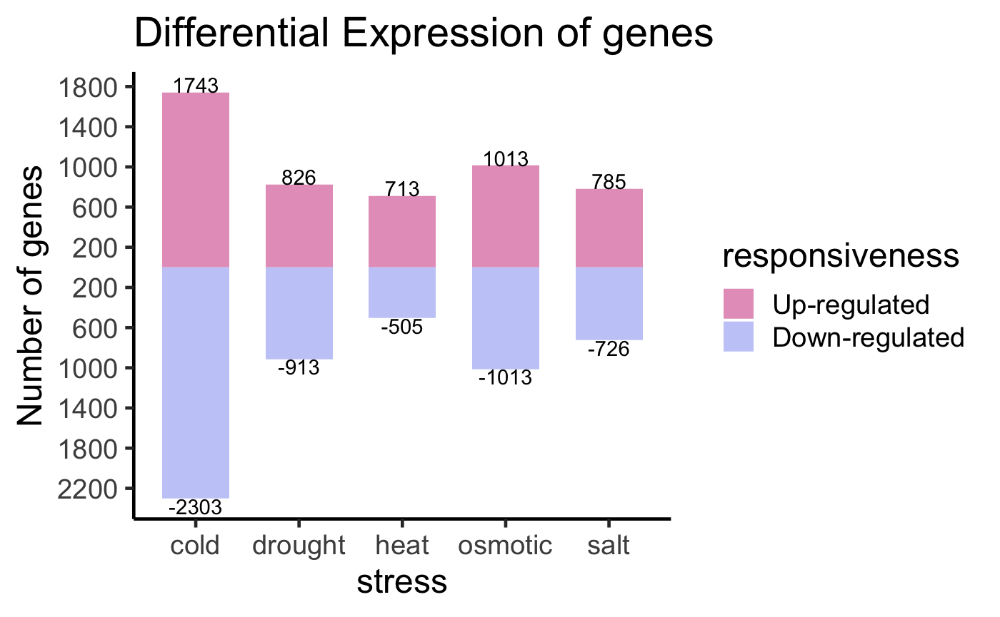

```{r setup, include=FALSE}
knitr::opts_chunk$set(echo = TRUE)
```


## Installation of R and RStudio

Please go these websites to download and install R and RStudio. 

R - https://www.r-project.org  

RStudio - https://posit.co/downloads/  

For Rstudio, download the free version available on the downloads page.
 
Goal of our workshop is to create this plot that we see below:



## Basic operations
Some very basic operations you can can carry out in R. 

```{r}
1 + 1 # addition
2 - 1 # subtraction
2 * 2 # multiplication
6 / 2 # division
3 ** 2 # exponential
3 ^ 2 # exponential
```
Here R works like a calculator. Apart from numbers, R can also help us print letters or a string of letters. 

```{r}
"a"
'a'
"language"
"R is my favourite programming language"
```

When working with large numbers such as **1934929292** and **23992343**, we cannot keep them in mind, or for that matter, remember complex computations. So, we have the concept of object or variable. 

```{r}
a <- 1934929292
b <- 23992343
a
b
```
Here, we assign "<-" the first number to "a" and the second to "b". The "<-" is called the "assignment operator". "a" and "b" are called objects or variables. This now enables us to actually use the variables for doing further operations as seen below.

```{r}
a + b
a - b
a * b
a ^ b
```
We can do something similar with strings too. 
```{r}
x <- "language"
y <- "R is my favourite programming language"
x
y
```

```{r}
print(x)
print(y)
```

## Creating a vector
In R, vectors are the most basic data objects. Let us create vectors **x** and **y**. We will do that in two ways. One, using the *c()* function, and the other using the *seq()* function. 'c' combines values into a vector. 'seq' is a sequence generator.  

```{r}
x <- c(1, 2, 3, 4, 5, 6, 7, 8, 9, 10)
y <- seq(11, 20)
x
y
```
The code above creates two vectors, **x** and **y**. Adding the two vectors gives:


```{r}
x + y
x * y
```
The elements are added element-wise. The operations in R are element-wise. As an exercise you can try doing the other mathematical
operations on the two vectors. 

## Indexing
The elements in the vectors are indexed. So, to extract an element you need only know its position. To extract the first element in x and in y:

```{r}
x[1]
```
This returns **1**. Try the following and see what you get. 

```{r}
y[1:4]
y[c(1, 3, 5)]
y[c(-1, -3, -5)]
y[-c(1, 3, 5)]
```
## Data types

What are the important data types? They can be listed as:

* **integer**
* **numeric**
* **logical**
* **character**
Let us first create some vectors

```{r}
n <- 1 # numeric
i <- 1L # integer
l <- TRUE # logical
c <- "Some string" #character
```
Here we have four vectors created. x is a numeric vector, y an integer vector, t a logical vector, and c is a character vector. Remember, in R everything is a vector. There are no scalars. Therefore, all these vectors that we have created are all vectors of length one. To check the length of the vector, use the length() function:

```{r}
length(n)
length(i)
length(l)
length(c)
```
You can see that all objects created are of length one. 

Now let us check these vectors using the *class()* function:
```{r}
class(n)
class(i)
class(l)
class(c)
```
Now let us create vectors of length > 1
```{r}
num_vr <- c(1, 3.0, 5.0) # numeric vector
int_vr <- c(1L, 3L, 5L) # integer vector
log_vr <- c(TRUE, FALSE, TRUE) # logical vector
char_vr <- c("I am", "a", "string.") # character vector
```
Now get their class.
```{r}
class(num_vr); length(num_vr)
class(int_vr); length(int_vr)
class(log_vr); length(log_vr)
class(char_vr); length(char_vr)
```
We learnt to make vectors before, and now we have learnt to understand them a bit more. We now move on to matrices.
First, let us create some vectors. 
```{r}
v1 <- 1:5
v2 <- 6:10
v3 <- 11:15
```
We have three vectors v1, v2, and v3 and we are going to bind them column-wise.
```{r}
cbind(v1, v2, v3)
```
The output just spews out to the console, which is not helpful. Let us create a variable, my_mat, and store the output
```{r}
my_mat <- cbind(v1, v2, v3)
my_mat
```
Here, we used a function, cbind(), to bind three vectors into three columns. Now let us use the class function on the my_mat variable.
```{r}
class(my_mat)
```
my_matrix is a matrix. It has three columns, v1, v2, and v3. And, as it should be clear now, we used three vectors to create a matrix. Let us now see an alternate method for creating a matrix. 
```{r}
trial_mat <- matrix(1:20, nrow=5, ncol=4, byrow = TRUE)
trial_mat
```

This creates a matrix with 4 rows and 5 columns. The [1,] refers to the first row. The [,1] refers to the first column. 

Let us now talk about another kind of data structure, data frame. So, a data frame is similar to a matrix, but it can hold vectors of different classes. Let us create the same vectors we created previously even though they are still in memory. 

```{r}
num_vr <- c(1, 3.0, 5.0) # numeric vector
int_vr <- c(1L, 3L, 5L) # integer vector
log_vr <- c(TRUE, FALSE, TRUE) # logical vector
char_vr <- c("I am", "a", "string.") # character vector

# Let us use the cbind() function to put them together.

new_mat <- cbind(num_vr, int_vr, log_vr, char_vr)
new_mat
```
Looking at the output, we know that it is something we do not want. What is the class of the new variable?

```{r}
class(new_mat)
```
The class of the object new_mat is "matrix". A matrix can hold data belonging to a particular class. In this case, every data point is converted into a character. This is called coercion. Here we need a different kind of data structure that can hold different classes of data. To demostrate this point, let us create some vectors that we will make use of in creating this structure. 

```{r}
set.seed(1234) # since the numbers are random, this will make sure we always 
              # get the same set of random numbers
plant_height <- rnorm(100, 110, 10)
head(plant_height)
```

Too many decimals. Let us round it off to two.

```{r}
plant_height <- round(plant_height, 2)
head(plant_height)
```

```{r}
set.seed(237)
flowering_50 <- round(rnorm(100, 100, 10))
head(flowering_50)
```

```{r}
set.seed(6438)
spikelet_fertility <- round(rnorm(100, 90, 3), 2)
head(spikelet_fertility)
max(spikelet_fertility)
```

```{r}
set.seed(345)
thousand_seed_weight <- round(rnorm(100, 22, 3), 2)
head(thousand_seed_weight)
```

Now let us combine the four vectors into a single data structure.

```{r}
my_data <- cbind(plant_height, flowering_50, spikelet_fertility, thousand_seed_weight)
head(my_data)
class(my_data)
```

Let us now create some numbers that we will use as genotype ids. We have 100 observations and that makes it 100 genotypes. We will name the genotypes from "001" to "100". Let us use the paste() function to create these ids. 

```{r}
a1 <- paste("00", 1:9, sep = "")
a2 <- paste0("0", 10:99)
genotypes <- c(a1, a2, 100)
genotypes
```

Let us add this vector to our my_data object.

```{r}
newdat <- cbind(genotypes, my_data)
head(newdat)
```

We have seen this problem before; the entire data getting converted into a character class. To overcome this problem we use the data.frame() function. 

```{r}
field_data <- data.frame(genotypes, my_data)
head(field_data)
```

This output is more like it. Let us check the class of the df object.

```{r}
class(field_data)
```

It is a dataframe. A dataframe, unlike a matrix, can hold vectors of different classes. Using the most important function in R, str(), we get a glimpse of what the field object contains.

```{r}
str(field_data)
```

The "field" object is a data frame with 100 observations and 4 variables. Except for a, which is a factor, plant_height, flowering_50, and spikelet_fertility are numeric. Remember that 'a' is a vector containing the genotype ids. Therefore, "a" is recognised as a factor here. 

### Writing data to file
```{r, eval=F}
write.csv(field_data, "field_data.csv", quote = F, row.names = F)
```

## Plotting with ggplot2
### Introduction
ggplot2 is "A system for 'declaratively' creating graphics, based on 
`The Grammar of Graphics`. You provide the data, tell 'ggplot2' how to map 
variables to aesthetics, what graphical primitives to use, and it takes care of 
the details."

`The Grammar of Graphics`, written by Leland Wilkinson, presents a theoretical 
foundation for producing quantitative graphics. 
(https://www.amazon.com/Grammar-Graphics-Statistics-Computing/dp/0387245448/ref=as_li_ss_tl)

This book is the foundation for ggplot2 created by Hadley Wickham.

We are going to use the `faithful` and `iris` data sets to explore ggplot2. The data sets are part of the R package.

The following are important while using ggplot2.

1) Data 
  - Most important aspect
  - Data representation holds the key to what can be done with the data
  
2) Mapping 
  - Aesthetic mapping 
  Variables in the data linked to graphical properties 
  - Facet mapping
  Variables are linked to panels
3) Geometries
  - geom_*()
4) Themes
5) Scale

Installing and loading the package.

```{r}
# install.packages("ggplot2")
library(ggplot2)
```

The `faithful` data set contains information on the eruption pattern of the 
Old Faithful geyser in Yellowstone National Park.
```{r}
# Look at the data
str(faithful)
```
```{r}
head(faithful)
```

1) Data
```{r, fig.height=2, fig.width=4}
#data("faithful")
ggplot(data = faithful)
```

2) Mapping
```{r, fig.height=2, fig.width=4}
# Adding the mapping
ggplot(data = faithful, mapping = aes(x = eruptions))
```

3) Geometry

```{r, fig.height=2, fig.width=4}
# Basic histogram
ggplot(data = faithful, mapping = aes(x = eruptions)) + 
  geom_histogram()
```

The data and the aesthetics can be specified within the layer as well. 

```{r, fig.height=2, fig.width=4}
ggplot() + 
  geom_histogram(data = faithful, aes(x = eruptions))
```

4) Theme

```{r, fig.height=2, fig.width=4}
ggplot(faithful, aes(x = eruptions)) + 
  geom_histogram(colour = "black", fill = "white") +
  # theme_classic()
  # theme_bw()
  theme_minimal()
```

Colour based on mapping

```{r, fig.height=2, fig.width=4}
ggplot(faithful, aes(x = eruptions)) + 
  geom_histogram(aes(colour = eruptions < 3.1), fill = "white") +
  theme_classic()
```

Fill based on mapping

```{r, fig.height=2, fig.width=4}
ggplot(faithful, aes(x = eruptions)) + 
  geom_histogram(aes(fill = eruptions < 3.1), colour = "black") +
  theme_classic()
```

Let us now use the `iris` data set for further exploration of the ggplot2 package.

```{r}
str(iris)
```

```{r}
head(iris)
```


```{r, fig.height=2, fig.width=4}
# Basic scatterplot
ggplot(data = iris, mapping = aes(x = Petal.Width, y = Petal.Length)) + 
  geom_point(aes(colour = Species))+
  theme_classic()
```

5) Scale
Adding a different colour scheme

```{r, fig.height=6, fig.width=7}
RColorBrewer::display.brewer.all()
```


```{r, fig.height=2, fig.width=4}
ggplot(data = iris, mapping = aes(x = Petal.Width, y = Petal.Length)) + 
  geom_point(aes(colour = Species), size = 3) +
  theme_classic() +
  scale_colour_brewer(palette = "Set1")
```

6) Facets

```{r, fig.height=2, fig.width=6}
ggplot(data = iris, mapping = aes(x = Petal.Width, y = Petal.Length)) + 
  geom_point(aes(colour = Species), size = 3) + 
  facet_wrap(~ Species) +
  scale_colour_brewer(palette = "Set2")
```


```{r, fig.height=3}
ggplot(data = iris, mapping = aes(x = Petal.Width, y = Petal.Length)) + 
  geom_point(aes(colour = Species), size = 3) +
  facet_grid(Species ~ .) +
  scale_colour_brewer(palette = "Set2")
```

### Creating a mirror plot

In this section we will see how to make the plot shown below.


Reading data in:

```{r}
gene_nums_mirror <- read.csv( "up_down_gene_numbers.csv" )
gene_nums_mirror
```

This data set has three columns and 10 rows. It is about differentially expressed genes under different stress conditions. So, let us start plotting with *ggplot2*.

```{r, fig.height=3, fig.width=3}
#install.packages("ggplot2")
library( ggplot2 )
ggplot(data = gene_nums_mirror, aes(x = stress, y = num_genes)) +
  # geom_bar(stat = "identity")
  geom_bar( stat = "identity", position = "stack", width = 0.65 )
```

```{r}
gene_nums_mirror$num_genes[gene_nums_mirror$responsiveness=="down"] <-
  -gene_nums_mirror$num_genes[gene_nums_mirror$responsiveness=="down"]
gene_nums_mirror
```

```{r, fig.height=3, fig.width=3}
ggplot(data = gene_nums_mirror, aes(x = stress, y = num_genes)) +
  geom_bar(stat = "identity", width = 0.65)
```

Adding colour to the bars, a theme, x- and y-axis labels, and a main title.

```{r, fig.height=4, fig.width=6}
ggplot(data = gene_nums_mirror, aes(x = stress, y = num_genes, fill = responsiveness)) +
  geom_bar(stat = "identity", width = 0.6) +
  theme_classic(base_size = 14) +
  ylab("Number of genes") +
  xlab("Stress") +
  ggtitle("Differential expression of genes")
```

The figure legend has "down" on the top and "up" below. To change that default behavoiur, we need to re-order the levels: "up" first followed by "down", in the data set.

```{r}
# Define the new level order
new_levels <- c("up", "down", setdiff(levels(gene_nums_mirror$responsiveness), c("up", "down")))

# Modify the "responsiveness" column
gene_nums_mirror$responsiveness <- factor(gene_nums_mirror$responsiveness, levels = new_levels)

```

Apart from changing the levels, we provide labels for the legend in the code below.

```{r, fig.height=4, fig.width=6}
ggplot(data = gene_nums_mirror, 
       aes(x = stress, y = num_genes, 
           fill = factor(responsiveness, labels = c("Up-regulated", "Down-regulated")))) +
  labs(fill = "responsiveness") +
  geom_bar( stat = "identity", position = "identity", width = 0.6 ) +
  ylab("Number of genes") +
  xlab("Stress") +
  theme_classic(base_size = 14) +
  ggtitle("Differential Expression of genes") 
```

Adding the number of genes on the bars.

```{r, fig.height=4, fig.width=6}
ggplot(data = gene_nums_mirror, 
       aes(x = stress, y = num_genes, 
           fill = factor(responsiveness, labels = c("Up-regulated", "Down-regulated")))) +
  labs(fill = "responsiveness") +
  geom_bar( stat = "identity", position = "identity", width = 0.6 ) +
  ylab("Number of genes") +
  xlab("Stress") +
  theme_classic(base_size = 14) +
  ggtitle("Differential Expression of genes") +
  # geom_text(aes(label = num_genes))
  geom_text(aes(label = num_genes), vjust = ifelse(gene_nums_mirror$num_genes>0, 0,1), 
            colour = "black")
```

Setting the y-axis ticks:

```{r, fig.height=4, fig.width=6}
ggplot(data = gene_nums_mirror, 
       aes(x = stress, y = num_genes, 
           fill = factor(responsiveness, labels = c("Up-regulated", "Down-regulated")))) +
  labs(fill = "responsiveness") +
  geom_bar( stat = "identity", position = "identity", width = 0.6 ) +
  ylab("Number of genes") +
  xlab("Stress") +
  theme_classic(base_size = 12) +
  ggtitle("Differential Expression of genes") +
  geom_text(aes(label = num_genes), vjust = ifelse(gene_nums_mirror$num_genes>0, 0,1), 
            colour = "black") +
  # scale_y_continuous(breaks=seq(-3000, 1800, by = 600))
  scale_y_continuous(breaks=seq(-3000,1800,by=600),labels=abs(seq(-3000,1800,by=600)))
```

The final code snippet with a different colour scheme.

```{r, fig.height=4, fig.width=6}
# install.packages( "wesanderson" )
library( wesanderson )

ggplot(data = gene_nums_mirror, 
       aes(x = stress, y = num_genes, 
           fill = factor(responsiveness, labels = c("Up-regulated", "Down-regulated")))) +
  labs(fill = "responsiveness") +
  geom_bar( stat = "identity", position = "identity", width = 0.6 ) +
  ylab("Number of genes") +
  xlab("Stress") +
  theme_classic(base_size = 14) +
  ggtitle("Differential Expression of genes") +
  geom_text(aes(label = num_genes), vjust = ifelse(gene_nums_mirror$num_genes>0, 0,1), 
            colour = "black") +
  scale_y_continuous(breaks=seq(-3000,1800,by=400),labels=abs(seq(-3000,1800,by=400))) +
  scale_fill_manual(values = wes_palette(n=2, name = "GrandBudapest2"))
```


```{r}
sessionInfo()
```

